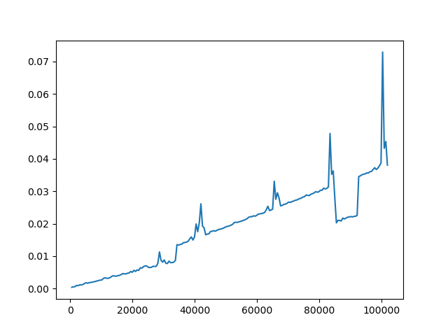

# Системи који раде у реалном времену
Тема: 

Хеш функције-упоређивање,судари и комплексност 
 
Аутор: Матеја Вујсић

## Захтеви


```bash
pip3 install matplotlib
```

## Код за цртање графика

```python3
import string
import random
import hashlib
import timeit
import matplotlib.pylab as plt

def randomly(size, chars=string.ascii_uppercase + string.digits):
    return ''.join(random.choice(chars) for _ in range(size))

dictOF=dict()

for i in range(512,102400,512):
    random_str = randomly(i)
    dictOF.update({i:timeit.timeit('hashlib.sha1(random_str).hexdigest()',
                        setup='import hashlib; random_str="%s".encode("utf-8")' % random_str,
                        number=200)})


lists = sorted(dictOF.items()) 

x, y = zip(*lists) 

plt.plot(x, y)
plt.show()

```

     
